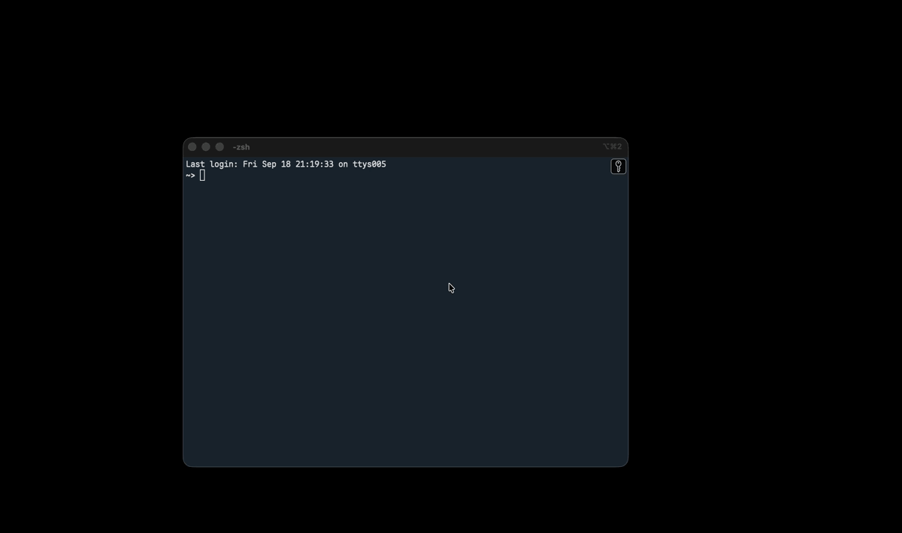
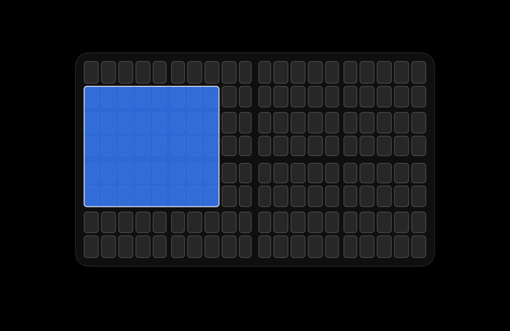

# GridSnap

An open source alternative to [Divvy](https://mizage.com/divvy/) for macOS. Press a shortcut, a grid appears, drag across the cells you want, and the window snaps there. Save a region as a preset and it becomes a one-keystroke snap.





- Grid overlay with live preview: the window follows your drag and jumps back if you cancel
- Presets with their own global shortcuts
- Undo the last snap
- Configurable grid size and gap between windows
- Snap the focused window or the one under the cursor
- Works across multiple displays
- Menu bar app, launch at login, no Dock icon

## Requirements

- macOS 14 or later. On macOS 26 the grid uses the system glass material; older versions get a frosted panel.
- Apple Silicon or Intel.
- To build: Xcode Command Line Tools with the macOS 26 SDK. No Xcode project, `swiftc` compiles the files directly.

## Install

Download `GridSnap-x.y.z.zip` from the [latest release](https://github.com/konieczkow/gridsnap/releases/latest), unzip it and drag GridSnap to Applications.

Two one-time prompts on first launch:

1. **"Apple could not verify GridSnap"**: the app is not notarized, since that needs a paid Apple developer account. Open System Settings › Privacy & Security, scroll down, and click **Open Anyway**.
2. **Accessibility**: GridSnap needs it to move other apps' windows. Turn it on under System Settings › Privacy & Security › Accessibility, then launch again.

Or build it yourself:

```sh
git clone https://github.com/konieczkow/gridsnap.git
cd gridsnap
./build.sh install
open /Applications/GridSnap.app
```

## Use

| Action | How |
|---|---|
| Show the grid | ⌃⌥D (change it in Settings) |
| Snap | Click or drag cells, release |
| Cancel | Esc, or drag outside the panel and release |
| Dismiss | Click anywhere outside the grid |
| Save a preset | Hold Shift when releasing, or use **+** in Settings |
| Apply a preset | Its shortcut, or the Presets menu |
| Undo last snap | ⌃⌥Z by default, press again to redo |

The grid appears on the display under the cursor and the window snaps to that display, so moving the mouse to another monitor before pressing the shortcut moves the window there. Presets snap to the display the window is already on.

Wider gutters in the grid mark halves, thirds and quarters.

**Settings** (menu bar icon › Settings…) holds both shortcuts, columns and rows, the gap in points between snapped windows, the target rule, and the presets table. Names and shortcuts are editable in place; **−** removes the selected preset.

## Development

```sh
./build.sh            # builds build/GridSnap.app
./build.sh install    # also copies it to /Applications
```

`Resources/icon.png` is the icon source; regenerate `AppIcon.icns` from it with `iconutil` if you change it.

Files in `Sources/`: `main.swift` startup, `AX.swift` window plumbing, `Grid.swift` overlay, `Presets.swift`, `Hotkeys.swift`, `ShortcutButton.swift` recorder, `SettingsWindow.swift`, `Menu.swift`, `Defaults.swift` stored settings.

macOS ties the Accessibility grant to the app's code signature. The default ad-hoc signature changes with every build, so you'd re-grant permission after each rebuild. To avoid that, create a self-signed certificate once (Keychain Access › Certificate Assistant › Create a Certificate, type "Code Signing", name it `GridSnap Dev`) and the build script picks it up. Any other identity works via `CODESIGN_IDENTITY="name" ./build.sh`.

## Known limitations

- Full-screen windows ignore snapping.
- Some apps enforce a minimum window size and won't shrink to a small cell.

## License

MIT, see [LICENSE](LICENSE).
